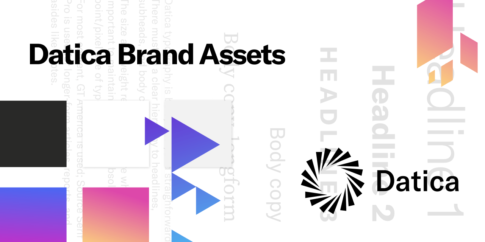

# Datica Brand Assets

Click the download button in the repository for an easy [zip download](https://github.com/daticahealth/brand-assets/archive/master.zip) of the entire thing. 

### For marketing and partner use

This repository is the primary location for downloading Datica brand assets like logos, color swatches, textures, and other brand elements.

### Typefaces

Datica uses [GT America](https://www.grillitype.com/typeface/gt-america) for our primary typeface; this font is not freely distributable. Please contact allan@datica.com if you are a vendor and need the typeface.

Our secondary typefaces are open source: [Roboto](https://fonts.google.com/specimen/Roboto) and [Source Serif Pro](https://github.com/adobe-fonts/source-serif-pro/tree/release/OTF).

### Usage

You can download our style guide as a .pdf [here](https://downloads.ctfassets.net/189dvqdsjh46/7LykBR7TfoEZ6vUjl3G8BQ/f38505c8ec7a50a72c1a394033487c3b/Datica_Style_Guide_2019.pdf). Ask us about the Figma version which is the most current at [datica.com/press](https://datica.com/press).
