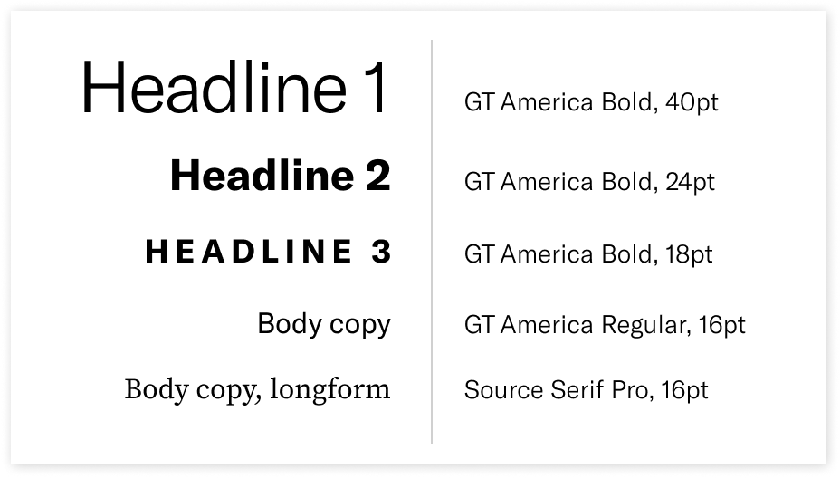

# Datica Typefaces

Datica uses [GT America](https://www.grillitype.com/typeface/gt-america) for our primary typeface; this font is not freely distributable. Please contact allan@datica.com if you are a vendor and need the typeface.

Our secondary typefaces are open source: [Roboto](https://fonts.google.com/specimen/Roboto) and [Source Serif Pro](https://github.com/adobe-fonts/source-serif-pro/tree/release/OTF).
